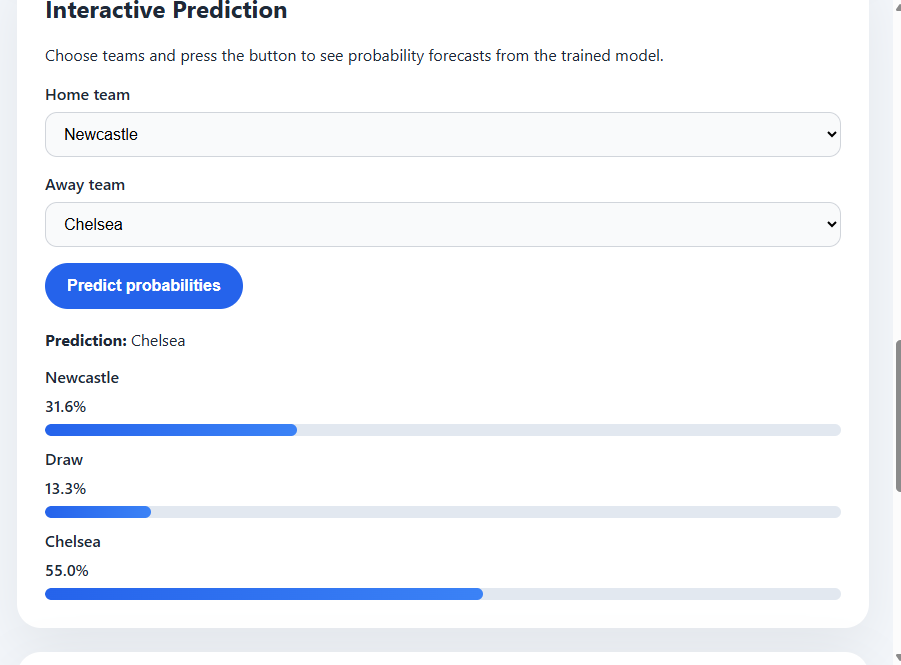

# ⚽ Football Match Outcome Prediction System

## 📌 Overview

This project is an end-to-end machine learning system that predicts football match outcomes (Home Win / Draw / Away Win) using historical match data, engineered statistical features, and bookmaker odds.

The objective of this project is to evaluate whether machine learning models can extract predictive signals beyond those already embedded in betting market odds.

---

## 📊 Live Prediction Example



---

## 🧠 Problem Statement

Predicting football match outcomes is a complex task due to:

- High randomness in sports events  
- Strong influence of external factors (injuries, tactics, morale)  
- Highly efficient betting markets  

This project investigates whether structured historical data and machine learning can meaningfully compete with bookmaker-implied probabilities.

---

## 🔄 System Pipeline

1. Raw match data ingestion from multiple seasons  
2. Data cleaning and normalization  
3. Feature engineering from historical performance  
4. Construction of predictive datasets  
5. Model training using multiple algorithms  
6. Time-based evaluation to simulate real-world prediction  
7. Comparison against bookmaker odds baseline  

---

## 🔧 Feature Engineering

All features are strictly computed using **pre-match information only**, ensuring no data leakage.

### ⚡ Team Strength (ELO System)
- Home team ELO rating  
- Away team ELO rating  
- ELO difference  

### 📈 Team Form Indicators
- Recent match performance (weighted decay)  
- Goals scored and conceded  
- Goal difference trends  

### ⏱️ Rest & Fatigue Metrics
- Days of rest for home team  
- Days of rest for away team  
- Rest advantage differential  

### 🤝 Head-to-Head Statistics
- Historical encounters between teams  
- Average goals and points in matchups  

### 💰 Market-Based Features
- Bookmaker implied probabilities  
- Market confidence score  
- Probability spread between outcomes  

---

## 🤖 Machine Learning Models

The following models were evaluated:

- Logistic Regression (baseline linear model)  
- LightGBM (gradient boosting model)  
- XGBoost (boosted tree ensemble)  
- Decision Tree (interpretable baseline)  

---

## 📊 Evaluation Methodology

### ⏳ Time-Based Splitting

To simulate real-world prediction conditions:

- Training set: First 80% of chronological matches  
- Test set: Last 20% of chronological matches  

This ensures no future information leakage.

---

### 📏 Metrics Used

- Accuracy → Correct match outcome prediction  
- Log Loss → Probability quality and calibration  

---

## 📈 Results Summary

### 🏦 Bookmaker Odds Baseline
- Accuracy: ~51%  
- Strongest single predictive signal  

### 🤖 Machine Learning Models

- Logistic Regression: ~46–48%  
- LightGBM: ~44–45%  
- XGBoost: ~41–45%  
- Decision Tree: ~37%  

---

## 🔍 Key Findings

- Bookmaker odds consistently outperform standalone ML models  
- Betting markets already incorporate extensive hidden information  
- Machine learning adds limited additional predictive power  
- Best performance is achieved via hybrid weighting (odds + ML)  
- Data quality and external signals matter more than model complexity  

---

## 📁 Project Structure


football-prediction-system/
│
├── data/
│ └── raw/
├── src/
│ ├── data_collection.py
│ ├── data_cleaning.py
│ ├── feature_engineering.py
│ ├── model_training.py
│ └── predict.py
├── models/
├── assets/
│ └── prediction.png
├── README.md
├── requirements.txt


---

## ⚙️ Installation

```bash
pip install -r requirements.txt
🚀 Training the Model
python -m src.model_training data/raw/
🔮 Making Predictions
python -m src.predict data/raw/ "Home Team" "Away Team"
🚀 Future Improvements
Integration of Expected Goals (xG) data
Player injury and lineup information
Advanced probability calibration techniques
Model ensembling strategies
Deployment as a web application (Streamlit/Django)
Real-time match prediction system
🧠 Key Learnings

This project demonstrates:

End-to-end machine learning pipeline design
Feature engineering for structured sports data
Time-series validation techniques
Real-world limitations of predictive modeling
Importance of strong baselines (bookmaker odds)
Practical challenges in sports analytics
📌 Disclaimer

This project is for educational and research purposes only. It does not guarantee prediction accuracy and should not be used for betting or financial decisions.
